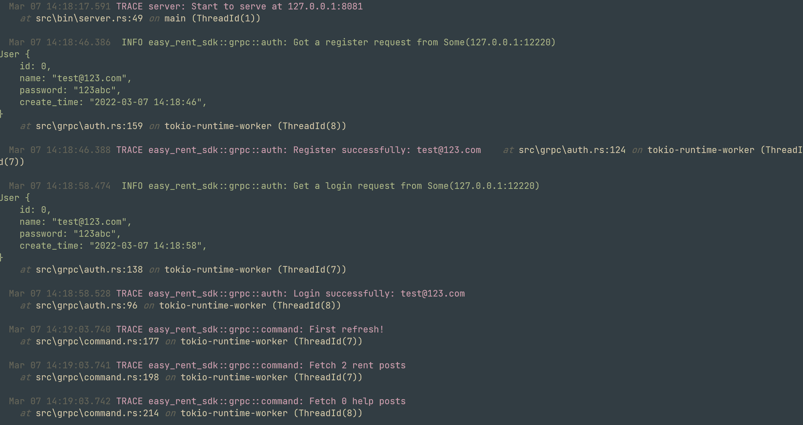

# Easy Rent (易租)

完结于大三(2020/05)上学期

架构：Flutter + gRPC + tonic + PostgreSQL

## UI 界面

|    |    |    |
|----------------------------------------------------------|----------------------------------------------------------|----------------------------------------------------------|
|    |    |    |
|    |    |  |
|  |

## 模拟数据和日志

```shell
sqlx migrate run # 还原所有的表结构
cargo run --release --bin json2db # 生成模拟数据并插入数据库
```


|  |  |
| ----------- | ----------- |
